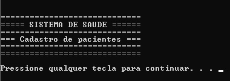
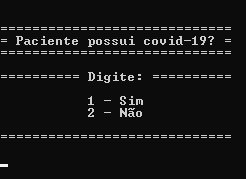
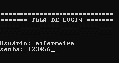
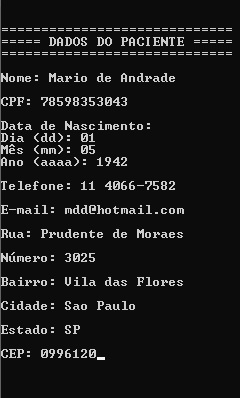
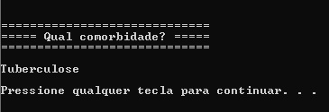
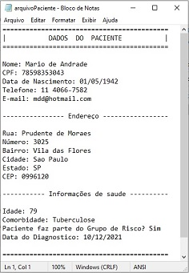
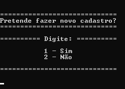
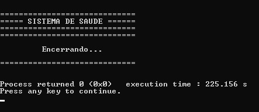

# SISTEMA DE HOSPITAL

Esse é um sistema em linguagem C para cadastro de pacientes diagnosticados com Covid-19. Foi desenvolvido como atividade do primeiro semestre do curso superior de tecnologia de análise e desenvolvimento de sistemas da Universidade Paulista. Para sua execução plena é recomendado o uso da IDE CodeBlocks.

 
Inicialmente o profissional de saúde que utilizar o sistema verifica se o paciente tem Covid-19:

 
Caso o paciente receba o diagnóstico positivo o profissional é levado a tela de login, o usuário é “enfermeira” e a senha ”123456”:

 
Na tela de cadastro são captados os dados pessoais e endereço do paciente. Nessa parte do código há uma função que filtra somente CPF válidos e outra função para validar datas de nascimento válidas:

 
Ao confirmar e digitar se o paciente tem comorbidade a informação é armazenada:

 
O sistema calcula a idade do paciente, verificar se ele tem alguma comorbidade e dessa forma confirma se o mesmo pertence ao grupo de risco (acima de 65 anos ou com comorbidade).
Os dados são salvos em um arquivo .txt gerado dentro da pasta do sistema, para consulta a qualquer momento:

 
Caso faça parte do grupo de risco, são salvas em outro arquivo .txt as informações de CEP e idade do paciente para serem enviadas para a central da Secretaria de Saúde da cidade.
Após a realização do cadastro há a opção de prosseguir com um novo cadastro:

 
Caso a escolha seja não, o sistema é encerrado:

